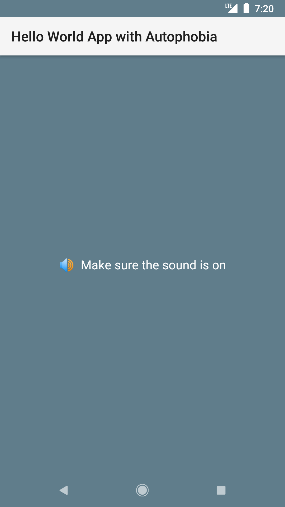

# Hello World App with Autophobia

Just leave the app (by tapping Back or Home, or by going to another app), and see how it reacts. Make sure the media volume is turned up.

Don't worry, the app is free of ads, does not require Internet access, and no permissions whatsoever.

### What is autophobia?

[Autophobia](https://www.google.com/search?q=autophobia), also called monophobia, isolophobia, or eremophobia, is the specific phobia of isolation, the fear of abandonment, of being alone or lonely.

### What is a "Hello World" app?

"Hello World" programs and apps are pretty famous, even if all they usually do is write "Hello, World!" on the screen. When learning a new programming language or platform (Kotlin on Android in this case), starting with such a simple app has become a tradition.

## Try the app

**[Download APK from Github Releases](https://github.com/appliberated/appwithautophobia/releases/latest)**

## Source Code

Hello World App with Autophobia is written in Kotlin using Android Studio.

## Contributions

Contributions are welcome! For feature requests and bug reports please [submit an issue](https://github.com/appliberated/appwithautophobia/issues).

## Support my work

Hello World App with Autophobia is a free app, and I enjoy creating and sharing learning projects like this, along with other useful [free apps](https://www.appliberated.com/). If you'd like to support my work, consider checking out the following Pro applications:

| Pro Apps | [Pitch Black Wallpaper Pro](https://www.tecdrop.com/pitchblackwallpaperpro/) | [RGB Color Wallpaper Pro](https://www.tecdrop.com/rgbcolorwallpaperpro/) |
| ------------ | ------------------------- | --- |
|  | <li>Pitch black & dark wallpapers</li><li>AI-generated wallpapers</li><li>Enhances battery life</li><li>Reduces eyestrain</li> | <li>Set any color as wallpaper</li><li>Endless color options, built-in & custom</li><li>Reduce visual clutter</li><li>Enhanced device aesthetics</li> |

## License

Hello World App with Autophobia is licensed under the [Apache License Version 2.0](LICENSE).
